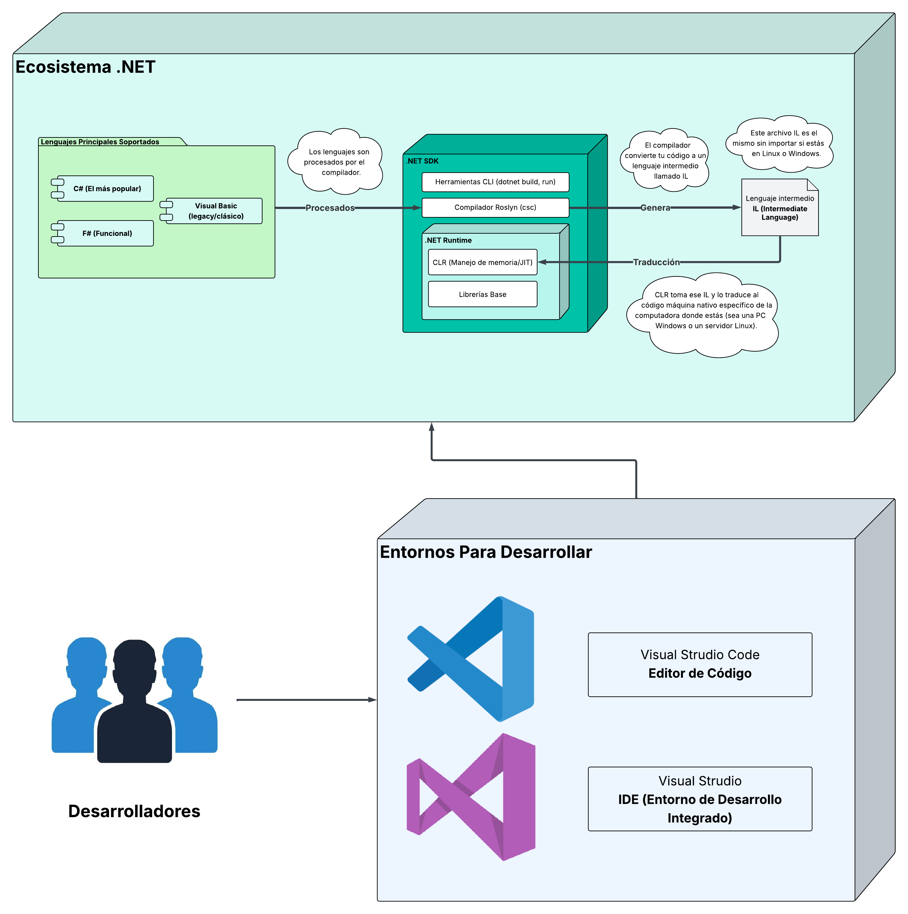
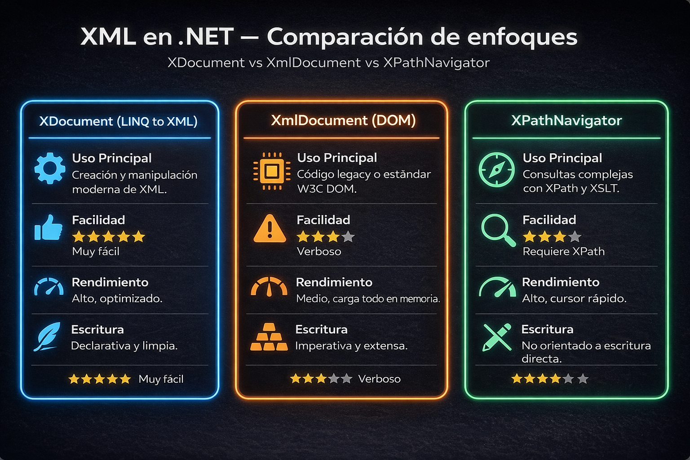
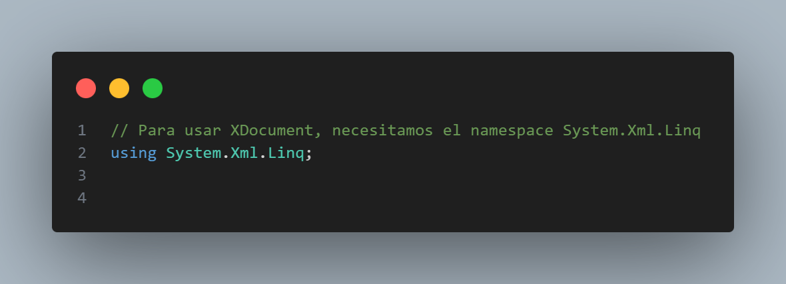
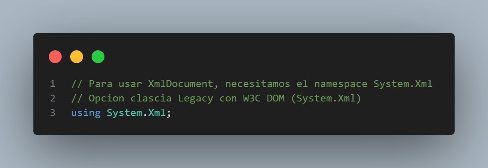
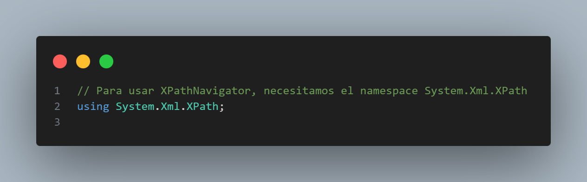
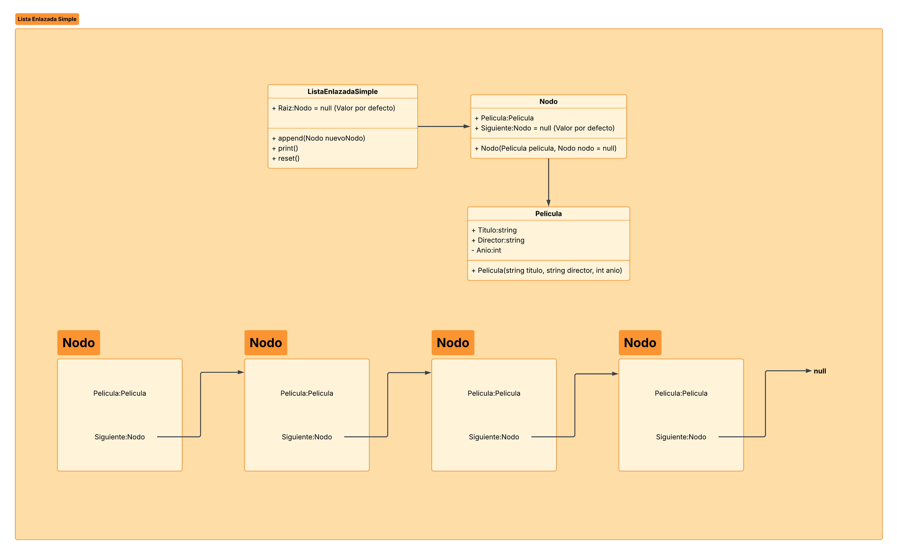
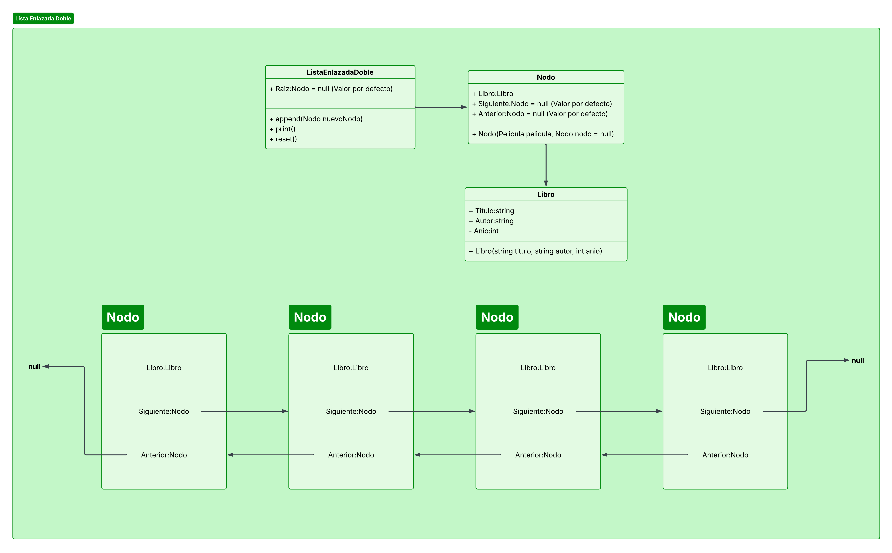
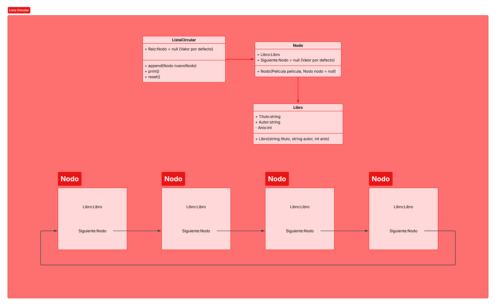
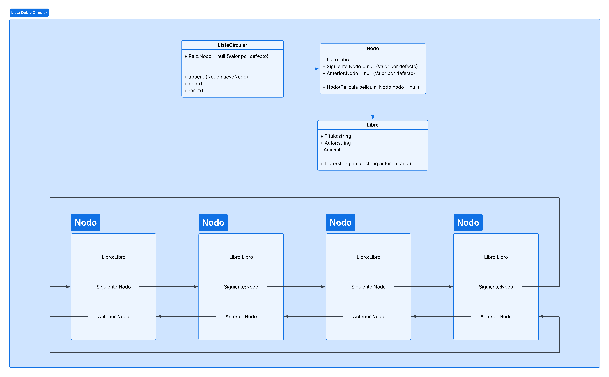

<!-- Tema oscuro estilo neón para GitHub -->
<div align="center">

# <span style="color:#00ffff;">Repositorio de Ejemplos — IPC2</span>

### <span style="color:#9b59ff;">Material de laboratorio y ejemplos didácticos</span>

</div>

---

## Índice
1. [.NET y C#](#net-y-c)
2. [Entorno de Desarrollo](#entorno-de-desarrollo)
3. [Comandos para .NET](#comandos-para-net)
4. [Versionamiento de Código](#versionamiento-de-código)
5. [Manejo de Archivos XML en C#](#manejo-de-archivos-xml-en-c)
6. [Tipos de Datos Abstractos (TDAs)](#tipos-de-datos-abstractos-tdas)

---

<div style="background-color:#0d1117; padding:20px; border-radius:12px;">

# Repositorio de Ejemplos, IPC2 N

> ## Índice
* [1. .NET y C#](#net-y-c)
* [2. Entorno de Desarrollo](#entorno-de-desarrollo)
* [3. Comandos para .NET](#comandos-para-net)
* [4. Versionamiento de Codigo](#versionamiento-de-código)
* [5. Manejo de Archivos XML en C#](#manejo-de-archivos-xml-en-c)
* [6. Tipos de Datos Abstractos (TDAs)](#tipos-de-datos-abstractos-tdas)

> ## .Net y C#

### ¿Qué es .NET?
En términos sencillos, **.NET** no es un lenguaje de programación en sí, sino una plataforma de desarrollo multiplataforma y de código abierto. Básicamente, es un **conjunto integral de herramientas**, bibliotecas y tecnologías creadas por Microsoft que nos permite construir casi cualquier tipo de aplicación (web, de escritorio, móviles, en la nube e incluso videojuegos).

#### El .NET SDK (Software Development Kit)
Para empezar a trabajar con esta plataforma, necesitamos instalar el **.NET SDK**. Este kit de desarrollo es el motor de nuestro entorno de trabajo, ya que nos proporciona absolutamente todas las herramientas necesarias para escribir, compilar, ejecutar y publicar nuestras aplicaciones. Al instalar el SDK, obtienes el compilador, las librerías base y la herramienta de línea de comandos (`dotnet CLI`).

---

### Una plataforma políglota
Una de las características más potentes de .NET es que es "políglota". Esto significa que la plataforma es capaz de entender y ejecutar código escrito en diferentes lenguajes de programación, compartiendo las mismas librerías base. Los lenguajes soportados oficialmente son:

* **C# (C-Sharp):** Moderno, fuertemente tipado y orientado a objetos. Es el lenguaje estrella y más popular de la plataforma.
* **F# (F-Sharp):** Un lenguaje enfocado principalmente en la programación funcional.
* **Visual Basic (.NET):** Un lenguaje con una sintaxis más verbal e histórica, orientado a la facilidad de uso.

> **💡 Enfoque del Laboratorio**
> Aunque .NET nos da la libertad de elegir entre varios lenguajes, durante nuestras prácticas nos enfocaremos exclusivamente en **C#**. Su sintaxis limpia, su robusto enfoque en la Programación Orientada a Objetos (POO) y su altísima demanda en la industria del software lo convierten en la herramienta perfecta para nuestro aprendizaje en este curso.

---

> ## Entorno de Desarrollo

### ¿Dónde escribiremos nuestro código?
Para escribir, compilar y ejecutar nuestro código, necesitamos un área de trabajo. En este laboratorio, tienen la libertad de elegir entre dos de las herramientas más populares de Microsoft, dependiendo de las capacidades de su computadora y de sus preferencias: un IDE o un Editor de Texto.

#### 1. Visual Studio (El IDE)
<p align="center">

</p>

**¿Qué es un IDE?** Sus siglas significan *Entorno de Desarrollo Integrado*. Imagínalo como un taller mecánico súper equipado. Viene con absolutamente todo preinstalado y configurado "fuera de la caja": autocompletado inteligente, herramientas de depuración (debugging) muy potentes y plantillas para crear proyectos con un par de clics.

* **Nuestra herramienta principal:** Para trabajar con C# y dominar la Programación Orientada a Objetos, **Visual Studio** (el del ícono morado) es el estándar de la industria. Es un programa más pesado, pero les facilitará enormemente el aprendizaje porque no tendrán que configurar nada manualmente.

---

#### 2. Visual Studio Code (El Editor de Texto)
<p align="center">

</p>

**¿Qué es un Editor de Texto?** A diferencia de un IDE, un editor de código avanzado es como una mesa de trabajo limpia y ligera, a la que tú le vas agregando únicamente las herramientas que necesitas a través de *extensiones* (plugins). 

* **La alternativa ligera:** **Visual Studio Code** (el del ícono azul) es un editor extremadamente rápido y consume mucha menos memoria RAM. Sin embargo, viene "en blanco"; para que funcione correctamente con nuestro código, tendrán que instalar extensiones (como el *C# Dev Kit*) y acostumbrarse a usar un poco más la consola de comandos. Es una excelente opción si su equipo tiene recursos limitados.

> **⚠️ ¡Cuidado con los nombres!**
> Aunque se llaman casi igual, son programas completamente diferentes. Recuerda: **Visual Studio (morado)** es el IDE completo, y **Visual Studio Code (azul)** es el editor ligero.

---

### El flujo de trabajo: ¿Cómo funciona el Ecosistema .NET?
Ahora que ya sabemos qué herramientas usar, es importante entender qué pasa exactamente "por debajo" cuando escribimos y ejecutamos nuestro código. El siguiente diagrama muestra cómo se conecta nuestro Entorno de Desarrollo con el Ecosistema de .NET:

<p align="center">

</p>

#### Paso a paso del proceso:

1. **El Entorno (Tú escribiendo código):** Todo comienza contigo. Como desarrollador, utilizas tu entorno (Visual Studio o VS Code) para escribir el código fuente de tu aplicación. Para este laboratorio, usaremos **C#**.
2. **El SDK y el Compilador:** Una vez que terminas de escribir y le das a "Ejecutar" o "Compilar", entra en acción el **.NET SDK**. Las herramientas de línea de comandos (CLI) le pasan tu código a **Roslyn**, el compilador de C#.
3. **El Lenguaje Intermedio (IL):** Aquí está la magia de la multiplataforma. El compilador *no* traduce tu código directamente a un archivo de Windows o de Linux. En su lugar, lo convierte en un código universal llamado **Lenguaje Intermedio (IL)**. Este archivo IL es exactamente el mismo sin importar en qué sistema operativo estés trabajando.
4. **El Runtime y el CLR:** Finalmente, para que tu computadora física pueda entender y ejecutar el programa, entra en juego el **.NET Runtime**. Su componente principal, el **CLR (Common Language Runtime)**, toma ese archivo IL y lo traduce en tiempo real (JIT) a código máquina nativo específico para tu computadora.

> **💡 En resumen:** Escribes en C# -> El compilador lo pasa a un lenguaje intermedio (IL) -> El CLR lo traduce al lenguaje de tu máquina para que funcione.

> ## Comandos Para .NET

```bash
# Comando para crear un proyecto de consola
dotnet new console -o nombreProyecto

# Comando para correr el proyecto, tienen que estar en la raiz del proyecto en la consola
dotnet run

# Agregar un packete al proyecto, tienen que estar en la raiz del proyecto en la consola
dotnet add package Rubjerg.Graphvi

# Agregar un proyecto al .sln, por si no se actualiza automaticamente
# En la ubiciacion del .sln
dotnet sln add 02_POO/02_POO.csproj
# 02_POO carpeta donde se encuentre el .csproj del nuevo proyecto
```

> ## Versionamiento de Código

En este laboratorio de IPC2, no solo aprenderemos a escribir código, sino también a gestionarlo de forma profesional. Para evitar el clásico problema de perder avances o confundir archivos, utilizaremos un sistema de control de versiones. 

A continuación, las tres herramientas clave que formarán nuestro flujo de trabajo:

### 1. Git: El motor principal
<p align="center">

</p>

**¿Qué es?** Git es un sistema de control de versiones distribuido. Funciona como una "máquina del tiempo" para tu código: registra cada cambio que haces en tus archivos de forma local en tu computadora. Esto te permite volver a versiones anteriores si algo sale mal y facilita el trabajo en equipo sin sobrescribir el código de tus compañeros.

---

### 2. GitHub: La nube para tu código
<p align="center">

</p>

**¿Qué es?** Si Git es el motor que funciona en tu computadora, GitHub es el servicio de alojamiento en internet. Es una plataforma donde subiremos nuestros repositorios (proyectos) controlados por Git. Funciona como una especie de red social y "nube" para desarrolladores, permitiéndote respaldar tu trabajo y colaborar de forma remota.

---

### 3. GitKraken: El entorno gráfico
<p align="center">

</p>

**¿Qué es y por qué lo usaremos?** Tradicionalmente, Git se maneja escribiendo comandos en una consola (como `git commit` o `git push`), lo cual puede ser muy abstracto cuando estás aprendiendo. GitKraken es un cliente gráfico (GUI) sumamente potente.
* **Nuestra ventaja:** Lo utilizaremos porque nos permite ver de forma **completamente gráfica e intuitiva el *Git workflow***. Con esta herramienta, podrán observar visualmente cómo crece el historial de cambios, cómo se separan las ramas (*branches*) y cómo se fusiona el código (*merges*), haciendo que conceptos complejos sean mucho más fáciles de entender.

> ## Manejo de Archivos XML en C#

En nuestros proyectos, será muy común que necesitemos guardar o leer información estructurada, y los archivos XML son perfectos para esto. .NET nos ofrece diferentes librerías (clases) para trabajar con este formato, cada una diseñada para un propósito y estilo de programación distinto. 

A continuación, veremos una comparativa de las tres opciones principales:

<p align="center">

</p>

---

### 1. XDocument (La opción recomendada 🌟)
**¿Qué es?** Es la forma más moderna y potente de trabajar con XML en C# (basada en LINQ to XML). Su sintaxis es muy limpia, directa y mucho menos "verbosa" (requiere menos líneas de código) que las alternativas más antiguas.
* **Lo que puede hacer:** Crear, leer, modificar y guardar archivos XML con mucha facilidad.
* **Por qué la usaremos:** Esta será la librería **recomendada para el curso** debido a que agiliza muchísimo el desarrollo y es el estándar actual en la industria.

<p align="center">

</p>

---

### 2. XmlDocument (El enfoque clásico / Legacy)
**¿Qué es?** Es la clase tradicional basada en el estándar W3C DOM. Aunque es totalmente funcional y seguramente te la encontrarás en bases de código más antiguas (*legacy*), escribir código con ella suele ser un proceso largo y repetitivo.
* **Lo que puede hacer:** Al igual que XDocument, sirve para crear y manipular XML, pero requiere declarar muchos más objetos para lograr el mismo resultado.

<p align="center">

</p>

---

### 3. XPathNavigator (El especialista en consultas)
**¿Qué es?** Es una clase diseñada específicamente para navegar rápidamente por un documento utilizando el lenguaje de consultas XPath. 
* **Lo que puede hacer:** Es excelente para realizar **consultas complejas** y leer datos específicos. 
* **Limitación importante:** Es de *solo lectura*. No puedes utilizar esta clase para construir o crear un archivo XML desde cero, solo para explorarlo.

<p align="center">

</p>

> **💡 En resumen:** Para las prácticas de este laboratorio, donde necesitamos tanto leer como generar archivos de configuración o reportes, **XDocument** será nuestra mejor herramienta.

> ## Tipos de Datos Abstractos (TDAs)

Un **TDA (Tipo de Dato Abstracto)** es un modelo lógico que define una colección de datos y las operaciones que se pueden realizar sobre ellos, sin especificar *cómo* se implementan internamente. En este laboratorio de IPC2, nos enfocaremos en construir manualmente nuestras propias estructuras de datos lineales.

Antes de entrar en las listas, debemos aclarar el concepto más importante para que funcionen: **Los Punteros (o Referencias).**

### 🧠 Concepto Clave: Punteros y Referencias de Memoria

Para conectar un nodo con otro, nuestra computadora necesita saber exactamente "dónde vive" el siguiente nodo en la memoria RAM.

#### ¿Cómo funciona en C++ (La forma explícita)?
En lenguajes como C o C++, el manejo de memoria es manual. Usamos símbolos especiales para decirle al compilador que queremos trabajar con la dirección de memoria y no con el valor:
* `*` (Asterisco): Declara un puntero (una variable que guarda una dirección).
* `&` (Ampersand): Obtiene la dirección de memoria física de una variable.

```cpp
// Ejemplo en C++
int numero = 10;
int* puntero = &numero; // "puntero" guarda la dirección (ej. 0x00F1) de "numero"
```

#### ¿Cómo funciona en C# (La forma implícita)?

En C#, **las clases son tipos de referencia**. Esto significa que C# nos facilita la vida ocultando los `*` y `&`, pero **por debajo funciona exactamente igual**. ¡Todo objeto que instanciamos con `new` es manejado internamente como un puntero!

**Ejemplo Práctico:**
Imaginemos que tenemos una clase `Perro`. Observen qué pasa cuando comparamos los objetos:

```cpp
// 1. Creamos un perro en una dirección de memoria (ej. 0x001)
Perro perro1 = new Perro(); 

// 2. Creamos OTRO perro nuevo en otra dirección (ej. 0x005)
Perro perro2 = new Perro(); 

// 3. Asignamos perro1 a perro3. 
// OJO: NO se crea un nuevo perro, solo copiamos la DIRECCIÓN de memoria.
// Ahora perro3 apunta a la misma dirección que perro1 (0x001).
Perro perro3 = perro1;

// --- Comparaciones ---

if (perro1 == perro2) 
{
   // ESTO ES FALSO (False).
   // Aunque sean idénticos por dentro, viven en direcciones de memoria distintas.
}

if (perro1 == perro3)
{
   // ESTO ES VERDADERO (True).
   // Ambos son "punteros" que señalan a la misma dirección de memoria física.
   // Si modificas perro3, perro1 también cambia, ¡porque son el mismo!
}
```

> **💡 Conclusión:** Cuando en nuestras listas enlazadas escribamos `nodoActual.Siguiente = nuevoNodo`, estamos haciendo exactamente esto: guardando la dirección de memoria del nuevo nodo para no perderlo.

---

### Estructuras de Datos Lineales

A continuación, las estructuras que implementaremos en el curso. Recuerden que para movernos entre los elementos (Nodos), utilizaremos las referencias explicadas arriba.

#### 1. Listas Enlazadas Simples

Es la estructura más básica. Cada nodo tiene el dato y un puntero hacia el siguiente nodo. El último nodo apunta a `null`, indicando el fin de la lista. Solo podemos recorrerla en una dirección (hacia adelante).

<p align="center">

</p>

#### 2. Listas Enlazadas Dobles

A diferencia de la simple, cada nodo tiene **dos punteros**: uno al `Siguiente` y otro al `Anterior`. Esto nos permite recorrer la lista en ambas direcciones (de inicio a fin y de fin a inicio), lo cual es muy útil para ciertas búsquedas, aunque consume un poco más de memoria RAM por nodo.

<p align="center">

</p>

#### 3. Listas Circulares Simples

Es similar a la lista simple, pero con una diferencia crucial: **no tiene fin (no existe el null)**. El puntero del último nodo apunta de regreso al primer nodo (la Cabeza). Esto permite recorrer la lista infinitamente en ciclos, ideal para colas de reproducción o turnos de juegos.

<p align="center">

</p>

#### 4. Listas Circulares Dobles

Combina lo mejor de los dos mundos. Tenemos punteros al `Siguiente` y al `Anterior`, y además es cerrada: el `Siguiente` del último nodo apunta al primero, y el `Anterior` del primer nodo apunta al último. Es una estructura robusta y flexible para navegar en cualquier dirección sin detenerse.

<p align="center">

</p>

</div>
